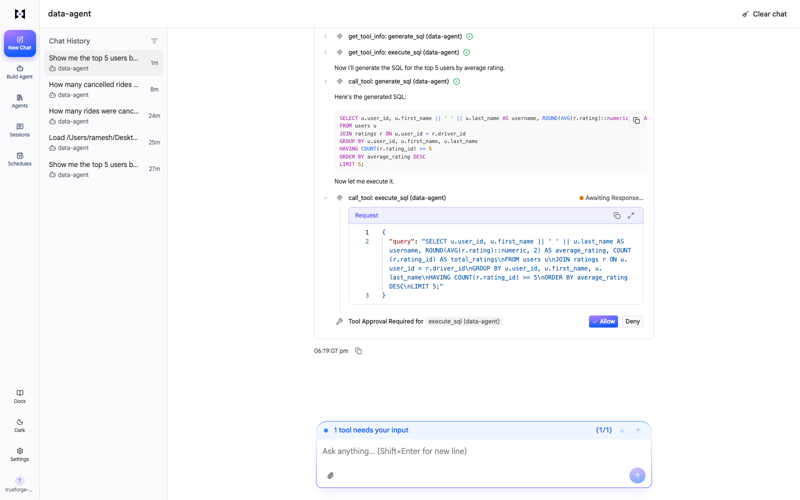

# Data_Agent — TrueForge Harness Rebuild

A rebuild of a LangGraph multi-agent data system (SQL + ETL) where **TrueForge is the
agent harness** — routing, HITL approval, and sandboxed execution live in TrueForge, not
in our code. Our `mcp-server/` only does *generation* (NL→SQL, NL→pandas) and *raw
execution primitives*.

**The dividing rule:** if a piece of logic decides *what to do next* (route, approve,
sandbox) it belongs to TrueForge. If it decides *what the answer is* (SQL text, pandas
code) it belongs to our MCP server.

## Submission summary

**The problem.** Getting answers out of a database still means either hand-writing SQL or
trusting a black box that runs whatever it generates. The first is slow; the second is
unacceptable the moment a query touches production or a transform writes a file.
Data_Agent gives you the speed of natural language with a mandatory human checkpoint on
every action that actually executes — the agent can *think* freely, but it cannot *act*
without you.

**How the agent handles it, end to end.** You ask a question in the TrueForge chat UI.
TrueForge's own agent loop reads the four tool descriptions and chooses which to call —
there is no router of ours anywhere in the system. For a data question it calls
`generate_sql` (read-only, allowed to run without interruption), which returns SQL text.
It then calls `execute_sql`, and here the turn **stops**: TrueForge raises
`tool.approval_required` and the session blocks until a human approves in the UI. On
approval, execution resumes against Postgres and the rows come back. The ETL path is
identical in shape — `generate_transform` produces pandas code, then `execute_transform`
triggers the same gate before anything runs. **Generation is free; execution is gated.**
That single boundary is the whole design.

**Tools used while building it.**

| Tool | Role in the build |
|---|---|
| **Claude Code** | Primary build tool — architecture, porting logic out of the reference repo, the FastMCP server, the Postgres loader, and debugging the TrueForge API integration end to end. |
| **TrueForge** (`@truefoundry/trueforge` v0.2.1) | The harness itself, in local standalone mode. Its OpenAPI spec was the reference for discovering the correct approval-policy surface and for debugging several integration failures. |
| **Fireworks AI** | Model provider inside the running app — three models mapped by task weight: `glm-5p2` (query curation), `kimi-k3` (SQL + pandas generation), `minimax-m3` (ETL path). |
| **Cursor / VS Code** | Reading the reference repo, intermediate scripts. |
| **Postman + `curl`** | Querying the TrueForge REST API directly when the UI couldn't show the agent's internal steps. |

## Architecture

```
User ──► TrueForge chat UI (localhost:8790)
             │  TrueForge's agent loop: tool selection · approval gate · sandbox
             ▼
        MCP server (localhost:8765/sse)  ← our only code
             ├── generate_sql        ──► LLM  → SQL text
             ├── execute_sql         ──► Postgres
             ├── generate_transform  ──► LLM  → pandas code
             └── execute_transform   ──► executes pandas code
```

No router tool exists. TrueForge reads the 4 tool descriptions and picks which to call.
The old repo's `RouterSchema`/router node, `is_safe` keyword check, and ETL sandbox wrapper
were all deleted — TrueForge replaces them.

## The 4 tools

| Tool | Input | Output | Approval | Sandbox |
|---|---|---|---|---|
| `generate_sql` | `question: str` | SQL text (not executed) | — | — |
| `execute_sql` | `query: str` | result rows | **required (HITL)** | — |
| `generate_transform` | `instructions: str` | pandas code (not executed) | — | — |
| `execute_transform` | `code: str` | execution output | **required (HITL)** | Daytona *intended*; see note |

Approval policy is set on the **agent** (`AgentSpec.mcp_servers[].require_approval_for_tools`),
not on the MCP registration manifest:
```json
{"name":"data-agent","require_approval_for_tools":["execute_sql","execute_transform"]}
```

> **Sandbox note (honest status):** TrueForge's Daytona sandbox is **not live** in this
> local standalone run — no sandbox provider is configured (`sandbox.enabled: false`), so
> `execute_transform` currently runs as a plain local `exec()` inside the MCP server
> process. Routing and approval delegation *are* fully live; the sandbox layer is wired but
> needs a Daytona provider configured.

## Verified end-to-end (question → approve → result)

Both paths were driven through the real TrueForge agent loop:

- **SQL** — *"Show me the top 5 users by average rating."*
  Agent called `generate_sql` (ran freely) → produced SQL → called `execute_sql` →
  **approval fired** → approved → returned real rows → TrueForge rendered a markdown table.
- **ETL** — *"Load payments.csv … keep rows where payment_status == 'success' … save."*
  Agent called `generate_transform` (ran freely) → produced pandas code → called
  `execute_transform` → **approval fired** → approved → code executed.

Evidence — the raw event pair from a real session (session `01m3evjds3xc1agk3qngx4pdds`):

```jsonc
// turn paused, waiting on a human
{ "type": "tool.approval_required", "created_at": "2026-09-26T12:38:36.418Z",
  "thread_id": "main",
  "tool_calls": [{ "id": "chatcmpl-tool-b9972bfb54ca9c12" }] }

// next turn: the human approved THAT tool call, execution resumes
{ "type": "turn.created", "created_at": "2026-09-26T12:40:48.361Z",
  "input": [{ "type": "user.tool_approval", "thread_id": "main",
              "tool_call_id": "chatcmpl-tool-b9972bfb54ca9c12",
              "approval": { "status": "allow" } }] }
```

The matching `tool_call_id` across the two events is the proof the gate actually blocks and
resumes — not just that a policy exists.



*Screenshot rendered via headless Chrome (`--headless=new`) against the live session while
the approval was pending — headless, because macOS Screen Recording permission is required
for `screencapture` and was not granted on this machine.*

## Layout

```
Data_Agent/
├── data/                  CSVs (loaded into Postgres data_agent_db)
├── mcp-server/            our only code
│   ├── server.py          FastMCP entrypoint, 4 tools, SSE transport
│   ├── sql_logic.py       curate → schema-fetch → SQL-gen (ported)
│   ├── etl_logic.py       context → pandas-gen (ported)
│   ├── database.py        Postgres util (ported)
│   ├── llm.py             LLM picker over OpenAI SDK → Fireworks
│   ├── feed_db.py         loads data/ CSVs into Postgres
│   └── requirements.txt
└── README.md
```

## Running it

```bash
# Postgres (Homebrew)
brew services start postgresql@16
psql -d postgres -c 'CREATE DATABASE data_agent_db;'

# Load data
cd mcp-server && python -m venv .venv && .venv/bin/pip install -r requirements.txt
.venv/bin/python feed_db.py

# MCP server (SSE on 127.0.0.1:8765)
.venv/bin/python server.py

# TrueForge (Node >= 22) — allow it to reach the loopback MCP server
OUTBOUND_URL_ALLOWED_HOSTS='["127.0.0.1"]' npx @truefoundry/trueforge
# then open http://localhost:8790/
```

Register the MCP server + agent (config in `PROJECT.md` build-order steps 4–5).
